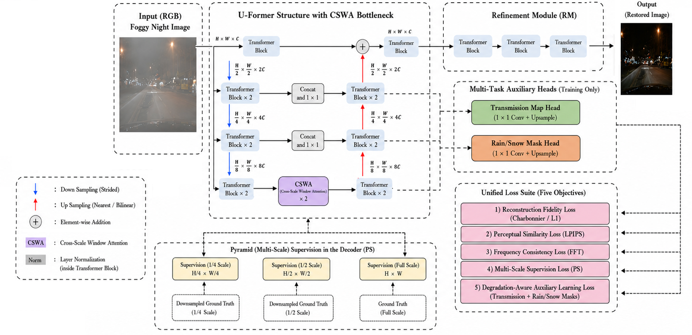

This repository contains the dataset, code and pre-trained models for our paper.

## NightFormer: A Unified Cross-Scale Transformer for Nighttime Adverse Weather Image Restoration   


Nighttime adverse weather image restoration is a challenging low-level vision task due to the combined effects of low illumination and heterogeneous weather degradations, including fog, haze, rain, and snow, which severely degrade scene visibility and obscure structural details. Existing restoration methods are largely designed for single degradation types, daytime environments, or generic image restoration, limiting their ability to effectively model the diverse degradation characteristics encountered in nighttime scenes within a unified framework. To address these challenges, we propose NightFormer, a unified Transformer-based architecture for nighttime adverse weather image restoration. The proposed framework introduces a Cross-Scale Window Attention (CSWA) module that integrates localized window attention with pooled global contextual representations, enabling simultaneous modeling of fine-grained weather artifacts and large-range atmospheric scattering while maintaining computational efficiency. To further enhance degradation-aware representation learning, the network is jointly supervised through auxiliary transmission estimation and precipitation mask prediction, encouraging intermediate features to capture physically meaningful degradation cues. In addition, a pyramid multi-scale supervision strategy progressively guides the decoder from coarse visibility recovery to fine structural refinement, improving restoration consistency across multiple spatial scales. The network is optimized using a multi-objective loss that combines pixel-level, perceptual, frequency-domain, multi-scale, and degradation-aware supervision to balance reconstruction fidelity with perceptual quality. Extensive experiments on a synthetic benchmark of 12,000 paired nighttime images derived from BDD100K demonstrate that NightFormer consistently outperforms recent unified restoration frameworks, general-purpose image restoration networks, and degradation-specific methods, achieving an average PSNR of 33.28 dB and 0.914 SSIM across fog, haze, rain, and snow degradations. Furthermore, evaluations on the DAWN and CDD-11 datasets demonstrate strong cross-dataset generalization without retraining or fine-tuning. These results demonstrate that NightFormer provides an effective, robust, and computationally efficient unified framework for nighttime adverse weather image restoration

## Get Started

### Dependencies and Installation
1. Create Conda Environment 
```
conda create -n NightFormer python=3.7
conda activate NightFormer
conda install pytorch=1.8 torchvision=0.3 cudatoolkit=10.1 -c pytorch
pip install matplotlib scikit-image opencv-python yacs joblib natsort h5py tqdm
```
2. Clone Repo
```
git clone https://github.com/mariasiddiqua/NightFormer.git
```

3. Install warmup scheduler

```
cd NightFormer
cd pytorch-gradual-warmup-lr; python setup.py install; cd ..
```

### Dataset
You can use the following link to download the dataset

BDD100K [[Link](https://drive.google.com/file/d/1J5x0NWMwwYEuyUQU7MNjDyjq9k0tFdNB/view?usp=drive_link)]

### Pretrained Model
We provide the pre-trained model:
- NightFormer trained on our synthetic BDD100K dataset [[google drive](https://drive.google.com/drive/folders/1pjTWVaIe7ayoiM6ZjekA7SgyWFJvmj3o?usp=drive_link)] with training config file `./configs/NightFormer.yaml`.

### Test
You can directly test the pre-trained model as follows

1. Modify the paths to dataset and pre-trained mode. 
```python
# Tesing parameter 
input_dir # the path of data
result_dir # the save path of results 
weights # the weight path of the pre-trained model
```

2. Test the models for BDD100K dataset

You need to specify the data path ```input_dir```, ```result_dir```, and model path ```weight_path```. Then run
```bash
python test.py --input_dir your_data_path --result_dir your_save_path --weights weight_path
```

### Train

1. To download BDD100K training and testing data

3. To train NightFormer, run
```bash
python train.py --opt your_config_path
```
```
You need to modify the config for your own training environment.
```

If you have any questions, please contact mariasiddiqua@hotmail.com

---


